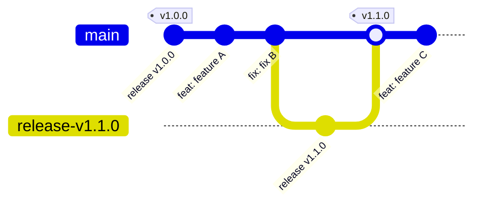

# Release Process

This project uses a fully automated release process powered by
[Releasaurus](https://releasaurus.rgon.io/). Developers only need to follow
conventional commits and merge features into `main` — the rest is automated.

## TL;DR

1. Create feature branches from `main`.
2. Follow [Conventional Commits](#semantic-commit-types).
3. Merge your feature branch into `main` — ensure commits that land on `main`
   have intentional commit messages (see [Merge Strategy](#merge-strategy)).
4. If there are releasable commits, a bot will create a release MR on `main`.
5. Review and merge the release MR (no squashing).
6. The CI will tag the release, publish a GitLab Release, update `CHANGELOG.md`,
   and rebuild Docker images with the new version tag.

## Conventional Commits & Merge Strategy

### Commit Message Rules

- Every commit that lands on `main` **must** follow the
  [Conventional Commits specification](https://www.conventionalcommits.org/).
- When squash-merging, the MR title becomes the commit message — make sure it
  follows the spec.
- When merging without squashing, each individual commit message must follow
  the spec.

### Semantic Commit Types

- **`feat:`** — New functionality (MINOR version bump).
- **`fix:`** — Bug fix (PATCH version bump).
- **`refactor:`**, `docs:`, `style:`, `ci:`, `chore:` — Non-releasable (no version
  bump, not included in changelog).
- **Breaking changes**: Add `!` to the type (e.g., `feat!:`) or add a
  `BREAKING CHANGE:` footer.

> While in `0.x` development, breaking changes bump MINOR instead of MAJOR.

### Merge Strategy

- **Feature branches → `main`**: Squash merging is **recommended** so each
  feature lands as a single, well-named commit. However, it is not required —
  you may also merge without squashing when you want to preserve multiple
  intentional commits (e.g. a dev branch that bundles 2 fixes and 1 feature).
  Just ensure every commit that reaches `main` has a proper conventional commit
  message.
- **Release PRs → `main`**: **Never squashed**. Preserves the `feat`/`fix` commit
  history that Releasaurus uses to anchor the next release.

## Developer Workflow

1. **Branch from `main`**:

   ```bash
   git checkout main && git pull
   git checkout -b feat/my-new-feature
   ```

2. **Follow Conventional Commits** in your commit messages (or MR title when
   squash-merging).

3. **Merge to `main`**. The automation takes over.

## Git Workflow & Automation

### Workflow Visualization



> The diagram uses simplified branch names for readability. Actual release branches
> are named `releasaurus/main/vX.Y.Z` (created automatically by Releasaurus).

### Automation Steps

1. **Release PR**: After a feature lands on `main`, the `release:pr` CI job
   runs Releasaurus. If there are new releasable commits since the last tag, it
   creates (or updates) a release MR — branch `releasaurus/main/vX.Y.Z` → `main`.
   - **Title**: `chore(main): release vX.Y.Z`
   - The MR body contains the generated changelog for review. Note that
     Releasaurus stores release metadata in hidden HTML comments inside the
     MR description; **editing the visible text does not change the published
     GitLab Release notes** (see [Customizing release notes](#customizing-release-notes)).
   - All version-bearing files are updated as part of the release MR commit:
     `pom.xml`, `compose/compose.kvasir.yml`, `kubernetes/kvasir/Chart.yaml`,
     and `kubernetes/kvasir/values.yaml`.

2. **Tag & Publish**: Once the release MR is merged, the `release:publish` job
   runs Releasaurus, which:
   - Creates the `vX.Y.Z` Git tag.
   - Publishes an official GitLab Release with the changelog.
   - Updates `CHANGELOG.md` on `main`.

3. **Docker Image Build**: The tag creation triggers a fresh `package:maven`
   pipeline that builds and pushes Docker images tagged as `X.Y.Z` and `latest`.

4. **API Reference Docs**: On stable tag pipelines (tags matching `vX.Y.Z` with no
   prerelease suffix), the `docs:api-render` job renders the OpenAPI spec and
   `docs:api-publish` uploads it to the GitLab Generic Package Registry under
   `api-reference/vX.Y.Z/index.html`.

   The `deploy:docs` job on `main` then finds the latest stable tag and fetches that
   version's API reference from the Package Registry. If no package is found yet
   (e.g. before the first stable release), a warning is logged with instructions to
   trigger the tag pipeline manually.

   > **Note**: Prerelease tags (e.g. `v0.21.0-alpha.1`) do **not** publish the API
   > reference to the Package Registry, and the main docs site will not pick them up.

## How to Create a Release

A project maintainer only needs to:

1. **Review the automated release PR** (`chore(main): release vX.Y.Z`).
2. **Merge the PR** into `main` (regular merge, not squash).

Everything else is automated.

### Local dry-run

To preview what the next release MR would look like without pushing anything:

```bash
just release-dry-run
```

This runs Releasaurus in local forge mode and prints the proposed version,
changelog, and file changes to stdout.

### Customizing release notes

Releasaurus stores release metadata (including the changelog) as **hidden
HTML comments** (`<!-- JSON -->`) inside the MR description. At publish time,
`release:publish` reads this hidden metadata — not the visible Markdown — to
populate the GitLab Release notes. This means:

- **Editing the visible MR description** before merging has no effect on the
  published release. The visible text is for human review only.
- **Editing `CHANGELOG.md`** on the release branch before merging changes the
  file that lands on `main`, but the GitLab Release notes still come from the
  hidden metadata — creating a mismatch.
- **Adding commits to the release branch** is risky: `release:pr` updates the
  branch in-place and can overwrite manual edits, and extra commits can break
  Releasaurus's tag anchoring (see [Troubleshooting](#troubleshooting)).

**To reword a commit in the changelog before publishing**, use the
`[[changelog.reword]]` array in `releasaurus.toml`. This lets you fix typos,
clarify descriptions, or change the commit type (which also affects the version
bump):

```toml
[[changelog.reword]]
sha = "abc123d"
message = "fix: corrected description of the change"

[[changelog.reword]]
sha = "def456e"
message = "feat: actual new feature, not a fix"
```

You can also reword via the CLI without modifying the config file, though this is less ideal for tracking manual adjustments:

```bash
releasaurus release-pr --reword "abc123d=fix: corrected description"
```

**To fix release notes after publishing**, use one of:

- **GitLab UI**: Settings → Releases → edit the description.
- **GitLab API**:

  ```bash
  TOKEN="<project-access-token>"
  PROJECT="<url-encoded-project-path>"
  curl -sf --request PUT \
    --header "PRIVATE-TOKEN: $TOKEN" \
    --header "Content-Type: application/json" \
    --data '{"description":"Your updated release notes here"}' \
    "https://gitlab.ilabt.imec.be/api/v4/projects/${PROJECT}/releases/vX.Y.Z"
  ```

- **Edit `CHANGELOG.md` on `main`** after the release is published. This
  updates the file but not the GitLab Release object.

> **Why can't I just edit the MR description?** Releasaurus uses hidden
> metadata to reliably roundtrip structured release data (package name, tag,
> notes) — especially important for monorepo setups where multiple packages
> share a single release MR. The visible Markdown is a human-readable
> rendering of that data, not the source of truth.

## Hotfix / Maintenance Releases

To release a fix against an older version:

1. **Create a maintenance branch** from the relevant release tag:

   ```bash
   git checkout -b v0.19 v0.19.0
   git push origin v0.19
   ```

2. **Cherry-pick** your fix commits onto the maintenance branch and push or target this branch with your Merge Request.

3. The CI automatically creates a hotfix release MR targeting `v0.19`.

4. Review and merge — the release is published with an incremented patch version
   (e.g., `v0.19.1`) on that maintenance branch.

## Prerelease Workflow

Prereleases (rc, alpha, beta) allow testing a release candidate before cutting a
stable version. Releasaurus supports this natively via the `[prerelease]` section
in `releasaurus.toml`.

### Entering prerelease mode

Set the `suffix` to your desired prerelease identifier (e.g. `rc`, `beta`, `alpha`).
When `suffix` is set and non-empty, Releasaurus enters prerelease mode and
produces tags with that suffix:

```toml
[prerelease]
suffix = "rc"
strategy = "versioned"
```

From this point, every releasable commit merged to `main` produces a prerelease
tag (e.g., `v1.0.0-rc.1`, `v1.0.0-rc.2`, …) instead of a stable tag.

The `strategy` controls how the suffix increments:

| Strategy    | Tags produced                   |
| ----------- | ------------------------------- |
| `versioned` | `v1.0.0-rc.1`, `v1.0.0-rc.2`, … |
| `static`    | `v1.0.0-rc` (no counter)        |

### Graduating to stable

To promote a prerelease series to a stable release:

1. **Comment out or remove** the `[prerelease]` section in `releasaurus.toml`.
2. **Commit** the change with a `chore:` prefix:

   ```bash
   git commit -am "chore: graduate prerelease to stable"
   ```

   Since `skip_chore = true` is set in our changelog config, this commit will not
   appear in the release notes.

   Releasaurus config is set up to aggregate commits from prerelease to stable,
   so the stable release notes will include all commits since the last stable
   release, even those that were released in prerelease form.

3. **Push / merge to `main`**. On the next pipeline, `release:pr` detects that the
   latest tag is a prerelease but no prerelease config is active, and proposes the
   stable version (e.g., `v1.0.0` instead of `v1.0.0-rc.3`).

4. **Review and merge** the release MR as usual (no squash).

### Alternative graduation via CLI

Instead of modifying `releasaurus.toml`, you can graduate from the command line by
overriding the prerelease suffix to empty:

```bash
# Disable prerelease for all packages
releasaurus release-pr --forge <forge> --repo <repo> --prerelease-suffix ""
# Or disable prerelease for a specific package
releasaurus release-pr --forge <forge> --repo <repo> --set-package <pkg>.prerelease.suffix=""
```

This is useful for one-off graduation without changing the config file.

---

## Troubleshooting

Most issues involve the git tag, the GitLab Release object, and/or the
`releasaurus-release-main` branch getting out of sync.

> **Note:** Earlier versions of Releasaurus had issues with prerelease graduation
> loops and GitLab's version tag ordering (prerelease suffixes sorting above
> stable). These have been fixed — if you are on a current version, the
> prerelease-specific sections below are unlikely to apply.

**Quick reference — the three things Releasaurus depends on being consistent:**

| Artifact                          | Must point to                                |
| --------------------------------- | -------------------------------------------- |
| Git tag `vX.Y.Z`                  | The `chore(main): release ... vX.Y.Z` commit |
| GitLab Release `vX.Y.Z`           | Same commit as the git tag                   |
| `releasaurus-release-main` branch | Freshly created from current `main`          |

**Universal recovery pattern:**

1. Fix the git tag (force-move if needed).
2. Fix the GitLab Release object (delete + recreate if needed).
3. Delete `releasaurus-release-main`.
4. Push an empty `ci:` commit to retrigger `release:pr`.

---

### Release MR keeps proposing an already-released version

`release:pr` opens an MR for a version that already has a tag and GitLab Release.

**Root causes and fixes:**

**A — Tag on wrong commit.** Force-move it to the `chore(main): release ...`
commit:

```bash
git log --oneline | grep "chore(main): release.*vX.Y.Z"
git tag -f vX.Y.Z <correct-sha>
git push origin refs/tags/vX.Y.Z --force
```

**B — GitLab Release object stale.** Force-moving a tag does NOT update the
Release object. Delete and recreate:

```bash
TOKEN="<project-access-token>"
PROJECT="<url-encoded-project-path>"
API="https://gitlab.ilabt.imec.be/api/v4/projects/${PROJECT}"

curl -sf --request DELETE --header "PRIVATE-TOKEN: $TOKEN" "$API/releases/vX.Y.Z"
curl -sf --request POST --header "PRIVATE-TOKEN: $TOKEN" \
  --header "Content-Type: application/json" \
  --data '{"tag_name":"vX.Y.Z","description":"<release notes>"}' \
  "$API/releases"
```

**C — Stale release branch.** Always delete it as part of recovery:

```bash
git push origin --delete releasaurus-release-main
git commit --allow-empty -m "ci: retrigger release:pr"
git push
```

---

### Post-release commits on the release branch break the next release

**Rule: never commit to the release branch after the tag has been created.**

If you need to annotate a release after publishing, edit the GitLab Release
description via UI (Settings → Releases) or API, or edit `CHANGELOG.md` directly
on `main`. See [Customizing release notes](#customizing-release-notes).

If you already committed to the release branch, follow Root cause A/B above and
add the offending commit to `skip_shas` in `releasaurus.toml`.

---

### `release:pr` fails with "Found pending release that has not been tagged yet"

`release:publish` failed or was skipped, leaving the `releasaurus:pending` label
on a merged MR. Remove it:

```bash
TOKEN="<project-access-token>"
PROJECT="<url-encoded-project-path>"
API="https://gitlab.ilabt.imec.be/api/v4/projects/${PROJECT}"

curl -sf --request PUT --header "PRIVATE-TOKEN: $TOKEN" \
  --header "Content-Type: application/json" \
  --data '{"remove_labels":"releasaurus:pending"}' \
  "$API/merge_requests/<MR_IID>"
```

Then retrigger `release:pr` (empty `ci:` commit or manual pipeline).

---

### Duplicate changelog-only release commit (FF merge)

With `merge_method = ff`, Releasaurus's post-release changelog commit can land on
`main` as a plain push, retriggering `release:publish`. Our CI has an idempotency
guard in `.ci/release.yml` that skips the duplicate (it checks whether `pom.xml`
was changed — only the real release commit bumps it).

If failures already occurred before the guard was in place, follow the
[universal recovery pattern](#troubleshooting) above.
