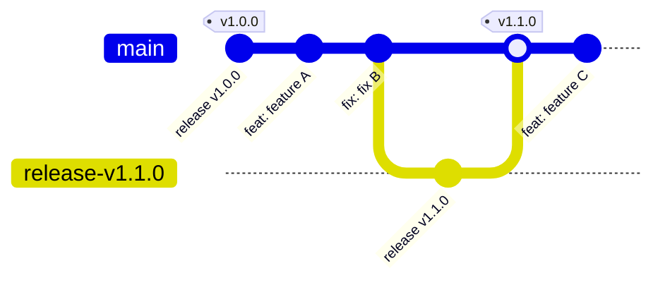

# Release Process

This project uses a fully automated release process powered by
[Releasaurus](https://releasaurus.rgon.io/). Developers only need to follow
conventional commits and merge features into `main` — the rest is automated.

## TL;DR

1. Create feature branches from `main`.
2. Follow [Conventional Commits](#semantic-commit-types) — the MR title is what matters.
3. Merge your feature branch into `main` (squashed).
4. If there are releasable commits, a bot will create a release PR on `main`.
5. Review and merge the release PR (no squashing).
6. The CI will tag the release, publish a GitLab Release, update `CHANGELOG.md`,
   and rebuild Docker images with the new version tag.

## Conventional Commits & Merge Strategy

### Commit Message Rules

- **MR titles**: **Must** follow the
  [Conventional Commits specification](https://www.conventionalcommits.org/)
  (this becomes the squashed commit message).
- **Branch commits**: Can be any message — they will be squashed when merged.

### Semantic Commit Types

- **`feat:`** — New functionality (MINOR version bump).
- **`fix:`** — Bug fix (PATCH version bump).
- **`refactor:`**, `docs:`, `style:`, `ci:`, `chore:` — Non-releasable (no version
  bump, not included in changelog).
- **Breaking changes**: Add `!` to the type (e.g., `feat!:`) or add a
  `BREAKING CHANGE:` footer.

> While in `0.x` development, breaking changes bump MINOR instead of MAJOR.

### Squashing Strategy

- **Feature branches → `main`**: **Always squashed**. This keeps `main` history
  clean and focused on features.
- **Release PRs → `main`**: **Never squashed**. Preserves the `feat`/`fix` commit
  history that Releasaurus uses to anchor the next release.

## Developer Workflow

1. **Branch from `main`**:

   ```bash
   git checkout main && git pull
   git checkout -b feat/my-new-feature
   ```

2. **Follow Conventional Commits** in your MR title.

3. **Merge to `main`** (squash). The automation takes over.

## Git Workflow & Automation

### Workflow Visualization



> The diagram uses simplified branch names for readability. Actual release branches
> are named `releasaurus/main/vX.Y.Z` (created automatically by Releasaurus).

### Automation Steps

1. **Release PR**: After a feature lands on `main`, the `release:pr` CI job
   runs Releasaurus. If there are new releasable commits since the last tag, it
   creates (or updates) a release PR — branch `releasaurus/main/vX.Y.Z` → `main`.
   - **Title**: `chore(main): release vX.Y.Z`
   - The PR body contains the generated changelog for review. Note that
     Releasaurus stores release metadata in hidden HTML comments inside the
     MR description; **editing the visible text does not change the published
     GitLab Release notes** (see [Customizing release notes](#customizing-release-notes)).
   - All version-bearing files are updated as part of the release PR commit:
     `pom.xml`, `compose/compose.kvasir.yml`, `kubernetes/kvasir/Chart.yaml`,
     and `kubernetes/kvasir/values.yaml`.

2. **Tag & Publish**: Once the release PR is merged, the `release:publish` job
   runs Releasaurus, which:
   - Creates the `vX.Y.Z` Git tag.
   - Publishes an official GitLab Release with the changelog.
   - Updates `CHANGELOG.md` on `main`.

3. **Docker Image Build**: The tag creation triggers a fresh `package:maven`
   pipeline that builds and pushes Docker images tagged as `vX.Y.Z` and `latest`.

4. **API Reference Docs**: On stable tag pipelines (tags matching `vX.Y.Z` with no
   prerelease suffix), the `docs:api-render` job renders the OpenAPI spec and
   `docs:api-publish` uploads it to the GitLab Generic Package Registry under
   `api-reference/vX.Y.Z/index.html`.

   The `deploy:docs` job on `main` then finds the latest stable tag and fetches that
   version's API reference from the Package Registry. If no package is found yet
   (e.g. before the first stable release), a warning is logged with instructions to
   trigger the tag pipeline manually.

   > **Note**: Prerelease tags (e.g. `v0.21.0-alpha.1`) do **not** publish the API
   > reference to the Package Registry, and the main docs site will not pick them up.

## How to Create a Release

A project maintainer only needs to:

1. **Review the automated release PR** (`chore(main): release vX.Y.Z`).
2. **Merge the PR** into `main` (regular merge, not squash).

Everything else is automated.

### Local dry-run

To preview what the next release PR would look like without pushing anything:

```bash
just release-dry-run
```

This runs Releasaurus in local forge mode and prints the proposed version,
changelog, and file changes to stdout.

### Customizing release notes

Releasaurus stores release metadata (including the changelog) as **hidden
HTML comments** (`<!-- JSON -->`) inside the MR description. At publish time,
`release:publish` reads this hidden metadata — not the visible Markdown — to
populate the GitLab Release notes. This means:

- **Editing the visible MR description** before merging has no effect on the
  published release. The visible text is for human review only.
- **Editing `CHANGELOG.md`** on the release branch before merging changes the
  file that lands on `main`, but the GitLab Release notes still come from the
  hidden metadata — creating a mismatch.
- **Adding commits to the release branch** is risky: `release:pr` updates the
  branch in-place and can overwrite manual edits, and extra commits can break
  Releasaurus's tag anchoring (see [Troubleshooting](#troubleshooting)).

**To fix release notes after publishing**, use one of:

- **GitLab UI**: Settings → Releases → edit the description.
- **GitLab API**:

  ```bash
  TOKEN="<project-access-token>"
  PROJECT="<url-encoded-project-path>"
  curl -sf --request PUT \
    --header "PRIVATE-TOKEN: $TOKEN" \
    --header "Content-Type: application/json" \
    --data '{"description":"Your updated release notes here"}' \
    "https://gitlab.ilabt.imec.be/api/v4/projects/${PROJECT}/releases/vX.Y.Z"
  ```

- **Edit `CHANGELOG.md` on `main`** after the release is published. This
  updates the file but not the GitLab Release object.

> **Why can't I just edit the MR description?** Releasaurus uses hidden
> metadata to reliably roundtrip structured release data (package name, tag,
> notes) — especially important for monorepo setups where multiple packages
> share a single release MR. The visible Markdown is a human-readable
> rendering of that data, not the source of truth.

## Hotfix / Maintenance Releases

To release a fix against an older version:

1. **Create a maintenance branch** from the relevant release tag:

   ```bash
   git checkout -b v0.x v0.19.0
   git push origin v0.x
   ```

2. **Cherry-pick** your fix commits onto the maintenance branch and push.

3. The CI automatically creates a hotfix release PR targeting `v0.x`.

4. Review and merge — the release is published with an incremented patch version
   (e.g., `v0.19.1`) on that maintenance branch.

## Prerelease Workflow

Prereleases (rc, alpha, beta) allow testing a release candidate before cutting a
stable version. Releasaurus supports this natively via the `[prerelease]` section
in `releasaurus.toml`.

### Entering prerelease mode

Set the `suffix` to your desired prerelease identifier (e.g. `rc`, `beta`, `alpha`).
When `suffix` is set and non-empty, Releasaurus enters prerelease mode and
produces tags with that suffix:

```toml
[prerelease]
suffix = "rc"
strategy = "versioned"
```

From this point, every releasable commit merged to `main` produces a prerelease
tag (e.g., `v1.0.0-rc.1`, `v1.0.0-rc.2`, …) instead of a stable tag.

The `strategy` controls how the suffix increments:

| Strategy    | Tags produced                   |
| ----------- | ------------------------------- |
| `versioned` | `v1.0.0-rc.1`, `v1.0.0-rc.2`, … |
| `static`    | `v1.0.0-rc` (no counter)        |

### Graduating to stable

To promote a prerelease series to a stable release:

1. **Comment out or remove** the `[prerelease]` section in `releasaurus.toml`.
2. **Commit** the change with a `chore:` prefix:

   ```bash
   git commit -am "chore: graduate prerelease to stable"
   ```

   Since `skip_chore = true` is set in our changelog config, this commit will not
   appear in the release notes.

   Releasaurus config is set up to aggregate commits from prerelease to stable,
   so the stable release notes will include all commits since the last stable
   release, even those that were released in prerelease form.

3. **Push / merge to `main`**. On the next pipeline, `release:pr` detects that the
   latest tag is a prerelease but no prerelease config is active, and proposes the
   stable version (e.g., `v1.0.0` instead of `v1.0.0-rc.3`).

4. **Review and merge** the release MR as usual (no squash).

### Alternative graduation via CLI

Instead of modifying `releasaurus.toml`, you can graduate from the command line by
overriding the prerelease suffix to empty:

```bash
# Disable prerelease for all packages
releasaurus release-pr --forge <forge> --repo <repo> --prerelease-suffix ""
# Or disable prerelease for a specific package
releasaurus release-pr --forge <forge> --repo <repo> --set-package <pkg>.prerelease.suffix=""
```

This is useful for one-off graduation without changing the config file.

---

## Troubleshooting

This section documents known failure modes and their recovery procedures.
Most issues involve the git tag, the GitLab Release object, and/or the
`releasaurus-release-main` branch getting out of sync.

**Quick reference — the three things Releasaurus depends on being consistent:**

| Artifact                          | Must point to                                |
| --------------------------------- | -------------------------------------------- |
| Git tag `vX.Y.Z`                  | The `chore(main): release ... vX.Y.Z` commit |
| GitLab Release `vX.Y.Z`           | Same commit as the git tag                   |
| `releasaurus-release-main` branch | Freshly created from current `main`          |

If any of these are wrong, Releasaurus will re-propose the same version
indefinitely. The recovery pattern is always:

1. Fix the git tag (force-move if needed).
2. Fix the GitLab Release object (delete + recreate if needed).
3. Delete `releasaurus-release-main`.
4. Push an empty `ci:` commit to retrigger `release:pr`.

---

### Release MR keeps proposing an already-released version

**Symptoms:** `release:pr` opens or updates an MR with a version that already has
a published GitLab Release and git tag.

**Root cause A — git tag moved to the wrong commit:**
Releasaurus requires the tag to point to the `chore(main): release ...` commit.
If the tag was moved (e.g. to a post-release commit), Releasaurus may not
recognise it as a valid release anchor.

Recovery:

```bash
# Find the correct release commit SHA
git log --oneline | grep "chore(main): release.*vX.Y.Z"

# Force-move the tag
git tag -f vX.Y.Z <correct-sha>
git push origin refs/tags/vX.Y.Z --force
```

**Root cause B — GitLab Release object points to a different commit than the tag:**
GitLab Release objects store their own commit reference independently of the git
tag. Force-moving the git tag does NOT update the Release object. Releasaurus
queries the GitLab Releases API (not raw git tags) to find its starting SHA, so a
stale Release object will override a correctly-placed git tag.

Check and fix using a project access token:

```bash
TOKEN="<project-access-token>"
PROJECT="<url-encoded-project-path>"   # e.g. kvasir%2Fkvasir-server
API="https://gitlab.ilabt.imec.be/api/v4/projects/${PROJECT}"

# Check what the Release object points to
curl -sf --header "PRIVATE-TOKEN: $TOKEN" "$API/releases/vX.Y.Z" \
  | python3 -c "import sys,json; r=json.load(sys.stdin); print(r['commit']['id'][:12])"

# If wrong: delete and recreate (preserves the git tag)
NOTES="<paste existing release notes>"
curl -sf --request DELETE --header "PRIVATE-TOKEN: $TOKEN" "$API/releases/vX.Y.Z"
curl -sf --request POST --header "PRIVATE-TOKEN: $TOKEN" \
  --header "Content-Type: application/json" \
  --data "{\"tag_name\":\"vX.Y.Z\",\"description\":$(python3 -c "import json,sys; print(json.dumps(sys.stdin.read()))" <<< "$NOTES")}" \
  "$API/releases"
```

**Root cause C — stale `releasaurus-release-main` branch:**
Releasaurus updates the release branch in-place. If the branch was generated
before a tag or Release fix, it will keep producing stale output even after the
tag is corrected. Always delete the branch as part of recovery.

```bash
git push origin --delete releasaurus-release-main

# Then retrigger:
git commit --allow-empty -m "ci: retrigger release:pr after release state fix"
git push
```

---

### Release MR keeps proposing a stable graduation of an already-graduated prerelease

**Symptoms:** Releasaurus log shows:

```
found starting sha: "<beta/alpha release commit>"
stable version strategy: graduating prerelease X.Y.Z-beta.N to stable
```

...but `vX.Y.Z` stable has already been released.

**Root cause:** `get_latest_tag_for_prefix` orders tags by semver descending and
returns the first one that is an ancestor of `main`. Normally this returns the
stable `vX.Y.Z` tag because semver sorts stable above prerelease. This symptom
only appears when the stable git tag was briefly absent, pointing at a
non-ancestral SHA, or the `releasaurus-release-main` branch was generated during a
window where the tag was broken — causing that stale branch to be reused with the
wrong anchor on subsequent `release:pr` runs.

**The actual fix is almost always deleting `releasaurus-release-main`** (Root cause C
above). Deleting the prerelease tag is not strictly necessary, but is safe since
the prerelease has already been superseded by the stable release.

**Recovery (try in order — stop when the next `release:pr` run anchors from the
stable tag):**

1. Ensure the stable git tag and GitLab Release both point to the correct commit
   (see Root cause A/B above).
2. Delete `releasaurus-release-main` and retrigger (see Root cause C above).
   This is usually sufficient.
3. If the graduation log line still appears after step 2, also delete the
   prerelease tag and its GitLab Release:

```bash
TOKEN="<project-access-token>"
PROJECT="<url-encoded-project-path>"
API="https://gitlab.ilabt.imec.be/api/v4/projects/${PROJECT}"

# Delete the prerelease GitLab Release
curl -sf --request DELETE --header "PRIVATE-TOKEN: $TOKEN" "$API/releases/vX.Y.Z-beta.N"

# Delete the prerelease git tag
curl -sf --request DELETE --header "PRIVATE-TOKEN: $TOKEN" "$API/repository/tags/vX.Y.Z-beta.N"
git tag -d vX.Y.Z-beta.N
git fetch --tags --prune-tags

# Delete stale release branch and retrigger
git push origin --delete releasaurus-release-main
git commit --allow-empty -m "ci: retrigger release:pr after removing stale prerelease tag"
git push
```

---

### Commits already released in a prerelease reappear in the stable release MR

**Symptoms:** The stable release MR changelog lists commits that were already
present in a previous prerelease entry.

**Root cause:** When graduating from prerelease to stable, Releasaurus collects
all commits since the last stable tag. If `aggregate_prereleases` is enabled,
this is intentional — the stable changelog should show the full set of changes.

**If you see duplicates and `aggregate_prereleases` is disabled:** The compare
link uses the prerelease tag as the lower bound. Releasaurus collects all commits
since that prerelease, including any that were between the prerelease and stable
release commits. Nothing is actually double-released; it is just listed again.

**Fix:** Enable `aggregate_prereleases = true` in the `[changelog]` section
(see [Prerelease Workflow](#prerelease-workflow)). This produces a clean
aggregated changelog for the graduating stable release.

If you need to suppress specific commits, add them to `skip_shas`:

```toml
[changelog]
skip_shas = [
    "38fc84c",  # fix: already included in vX.Y.Z-rc.1
]
```

---

### Post-release commits on the release branch break the next release

**Symptoms:** After manually adding a commit to the release branch (e.g. to
update `CHANGELOG.md` with a description) and merging it to `main`, the next
`release:pr` run re-proposes the same version.

**Root cause:** Releasaurus identifies a release commit by its message pattern
(`chore(main): release ...`). If additional commits are merged to `main` after
the release commit, and the git tag or GitLab Release is moved to point at one of
those newer commits, Releasaurus no longer recognises the tag as a valid release
anchor.

**Rule: never commit to the release branch after the tag has been created.**

If you need to annotate a release:

- Edit `CHANGELOG.md` directly on `main` after the release is fully published.
  This is visible in the file but NOT in the GitLab Release notes.
- For release notes that appear in the GitLab UI, edit the release description
  via Settings → Releases, or via the API:

```bash
TOKEN="<project-access-token>"
PROJECT="<url-encoded-project-path>"
curl -sf --request PUT \
  --header "PRIVATE-TOKEN: $TOKEN" \
  --header "Content-Type: application/json" \
  --data '{"description":"Your updated release notes here"}' \
  "https://gitlab.ilabt.imec.be/api/v4/projects/${PROJECT}/releases/vX.Y.Z"
```

If you already made this mistake, follow the recovery in
[Root cause A/B](#release-mr-keeps-proposing-an-already-released-version) above,
and add the offending commit to `skip_shas`.

---

### `release:pr` fails with "Found pending release that has not been tagged yet"

**Symptoms:** `release:pr` job fails with:

```
Found pending release (PR #N) on branch 'releasaurus-release-main' that has not been tagged yet:
cannot continue, must finish previous release first
```

**Root cause:** Releasaurus tracks in-flight release MRs by attaching a
`releasaurus:pending` label to them when they are created. It removes this label
inside `release:publish` after the tag and GitLab Release have been created. If
`release:publish` fails (or is skipped), the label is never cleaned up. On the
next `release:pr` run, Releasaurus finds the merged MR still carrying
`releasaurus:pending` and refuses to proceed.

**The most common trigger** in this repository is the duplicate changelog-only
commit described in the next section. That commit causes `release:publish` to
fail, leaving the label behind.

Recovery — remove the label from the stuck MR:

```bash
TOKEN="<project-access-token>"
PROJECT="<url-encoded-project-path>"
API="https://gitlab.ilabt.imec.be/api/v4/projects/${PROJECT}"

# Find the MR number from the error message (PR #N)
curl -sf --request PUT \
  --header "PRIVATE-TOKEN: $TOKEN" \
  --header "Content-Type: application/json" \
  --data '{"remove_labels":"releasaurus:pending"}' \
  "$API/merge_requests/<MR_IID>"
```

Then retrigger `release:pr` (push an empty `ci:` commit or manually trigger a
pipeline).

---

### Duplicate changelog-only release commit after a GitLab FF merge

**Background — what Releasaurus does after publishing a release:**
After `release:publish` creates the tag and GitLab Release, Releasaurus pushes an
additional commit to its release branch (`releasaurus-release-main`) that updates
`CHANGELOG.md` with the published changelog. This is a normal part of its
workflow.

**Why this becomes a problem with `merge_method = ff`:**
Under GitLab's fast-forward merge strategy, there is no true merge commit — the
release branch tip is fast-forwarded directly onto `main`. After the release MR is
merged this way, Releasaurus pushes its post-release changelog commit onto the
release branch. With FF merge, that commit then lands directly on `main` as a
plain push, triggering a new push pipeline. `release:publish` runs again, tries to
publish `vX.Y.Z`, and fails because the tag and GitLab Release already exist.

**What you see in git history:**

```
<sha-B>  chore(main): release kvasir-server vX.Y.Z   <- duplicate, CHANGELOG.md only
<sha-A>  chore(main): release kvasir-server vX.Y.Z   <- real release commit (pom.xml bumped, tagged)
```

**Idempotency guard in `release:publish`:**
`.ci/release.yml` contains a guard that detects this situation and exits cleanly:

```yaml
script:
  - |
    CHANGED_FILES=$(git diff-tree --no-commit-id -r --name-only "$CI_COMMIT_SHA")
    if echo "$CHANGED_FILES" | grep -q "^pom.xml$"; then
      echo "pom.xml changed — this is a real release commit, proceeding."
    else
      echo "pom.xml not changed — duplicate changelog-only commit, skipping."
      exit 0
    fi
```

The real release commit always bumps `pom.xml`; the duplicate only touches
`CHANGELOG.md`.

**Full recovery sequence** (if the guard was not in place and failures already
occurred):

```bash
TOKEN="<project-access-token>"
PROJECT="<url-encoded-project-path>"
API="https://gitlab.ilabt.imec.be/api/v4/projects/${PROJECT}"

# 1. Remove releasaurus:pending from the stuck MR (see previous section)
curl -sf --request PUT --header "PRIVATE-TOKEN: $TOKEN" \
  --header "Content-Type: application/json" \
  --data '{"remove_labels":"releasaurus:pending"}' \
  "$API/merge_requests/<MR_IID>"

# 2. Move the vX.Y.Z git tag to the duplicate commit (sha-B) — this makes both
#    commits covered by the tag so Releasaurus finds it as an ancestor
git tag -f vX.Y.Z <sha-B>
git push origin -f refs/tags/vX.Y.Z

# 3. Recreate the GitLab Release to point at sha-B
#    (force-moving the git tag does NOT update the GitLab Release object)
curl -sf --request DELETE --header "PRIVATE-TOKEN: $TOKEN" "$API/releases/vX.Y.Z"
curl -sf --request POST --header "PRIVATE-TOKEN: $TOKEN" \
  --header "Content-Type: application/json" \
  --data '{"tag_name":"vX.Y.Z","description":"<release notes>"}' \
  "$API/releases"

# 4. Delete any prerelease tags (e.g. vX.Y.Z-beta.N) that sort above the stable
#    tag in GitLab's version ordering — otherwise Releasaurus will anchor from them
curl -sf --request DELETE --header "PRIVATE-TOKEN: $TOKEN" "$API/releases/vX.Y.Z-beta.N"
curl -sf --request DELETE --header "PRIVATE-TOKEN: $TOKEN" "$API/repository/tags/vX.Y.Z-beta.N"

# 5. Delete the stale release branch so Releasaurus re-anchors cleanly
git push origin --delete releasaurus-release-main
# (or releasaurus-release-v0.23 for maintenance branches)

# 6. Close any stale release MRs that were created during the broken state
# (via GitLab UI or API)

# 7. Retrigger release:pr with a manual pipeline or empty ci: commit
```

**Note on GitLab's version tag ordering:** GitLab sorts prerelease suffixes
(`-beta.N`, `-rc.N`) **above** their stable counterpart when ordering tags by
version descending. This means `vX.Y.Z-beta.2` appears before `vX.Y.Z` stable in
the API response. Releasaurus picks the first ancestor tag from this list, so any
surviving prerelease tag will cause it to anchor from the prerelease and
re-propose a "stable graduation" even after the stable release is published.
Always delete prerelease tags once the stable release is confirmed good.

---

### Checking Releasaurus job logs

The project access token can be used to retrieve CI job logs directly:

```bash
TOKEN="<project-access-token>"
PROJECT="<url-encoded-project-path>"
API="https://gitlab.ilabt.imec.be/api/v4/projects/${PROJECT}"

# List recent main pipelines
curl -sf --header "PRIVATE-TOKEN: $TOKEN" "$API/pipelines?ref=main&per_page=5" \
  | python3 -c "import sys,json; [print(p['id'],p['status'],p['sha'][:8]) for p in json.load(sys.stdin)]"

# List jobs for a pipeline
curl -sf --header "PRIVATE-TOKEN: $TOKEN" "$API/pipelines/<id>/jobs" \
  | python3 -c "import sys,json; [print(j['id'],j['name'],j['status']) for j in json.load(sys.stdin)]"

# Fetch job log
curl -sf --header "PRIVATE-TOKEN: $TOKEN" "$API/jobs/<job-id>/trace"
```

Key lines to look for in a `release:pr` log:

- `found starting sha: "..."` — the commit Releasaurus anchors from; should be
  the `chore(main): release` commit of the last released version.
- `stable version strategy: graduating prerelease` — Releasaurus is in graduation
  mode; verify the prerelease tag/Release have been cleaned up if the stable is
  already published.
- `releasable packages: []` — no releasable commits; the MR will not be created
  or updated. This is normal after a `ci:` or `chore:` only push.
