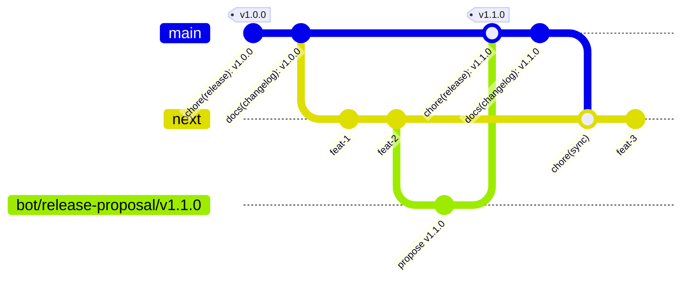
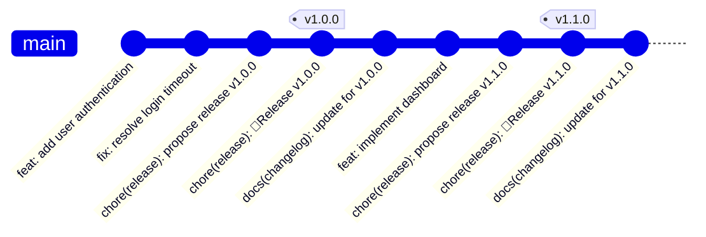

# 🚀 Release Process

This project uses a fully automated release process based on the `next` branch.
The CI pipeline manages versioning, changelog generation, and post-release
synchronization, so developers only need to focus on merging features.

## 📚 TL;DR

1. Create feature branches from `next`.
2. Follow [Conventional Commits](#semantic-commit-types).
3. Merge your feature branch into `next` (squashed).
4. If there are releasable commits, a bot will create a release proposal MR to
   `main`.
5. Review and merge the release MR into `main` (no squashing).
6. The CI will tag the release, update the changelog, and sync `main` back
   to `next`.

## 📝 Conventional Commits & Merge Strategy

### Commit Message Rules

- **MR titles**: **Must** follow the
  [Conventional Commits specification](https://www.conventionalcommits.org/)
  (this becomes the squashed commit message).
- **Branch commits**: Don't need to be perfect conventional commits.
  They can be regular commits with any message, as they will be squashed into a
  single commit when merged into `next`.
  Only `feat` and `fix` commits will be considered for versioning and changelog
  generation.
- **Squashed commit**: The body of the squashed commit message will
  automatically include the list of all commits from the feature branch.
  This way any additional features or fixes made during the MR review
  process are included in the release notes.

### Semantic Commit Types

- **`feat:`** - New functionality (results in a MINOR version bump).
- **`fix:`** - Bug fix (results in a PATCH version bump).
- **`refactor:`**, `docs:`, `style:`, etc. - Non-functional changes (do not bump
  the version).
- **Breaking changes**: Add `!` to the type (e.g., `feat!:`) or add a
  `BREAKING CHANGE:` footer to the commit body (results in a MAJOR version
  bump).

❗ At the moment as we are still in early development, we will keep
0.x versions for now, so any breaking change will result in a minor
version bump.

### Squashing Strategy

- **Feature/Fix Branches → `next`**: **Always squashed**. This keeps the history
  on `next` clean and focused on features rather than individual fixup commits.
- **Release Branches → `main`**: **Never squashed**. Regular merge commit
  `chore(release): 🚀 Release vX.Y.Z`. This preserves the
  `feat`/`fix` commit history on the `main` branch.
- **`main` → `next` (sync)**: **Never squashed**. Regular merge commit
  `chore(sync)`.

## 👨‍💻 Developer Workflow

1. **Branch from `next`**: Always create your feature or bugfix branches from
   the `next` branch.

   ```bash
   git checkout next
   git pull
   git checkout -b feat/my-new-feature
   ```

2. **Follow Conventional Commits**: Ensure your MR title follows the
   conventional commits format.

3. **Merge to `next`**: Create a Merge Request from your feature branch into the
   `next` branch. Once it's reviewed and merged (squashed), the release
   automation will take over. Make sure to rebase your branch with `next`
   before merging to avoid conflicts.

## 🔄 Git Workflow & Automation

### **Workflow Visualization**



**Simplified Flow Overview:**

```text
Features → next → Release Branch → main → Sync back to next
   ↓         ↓           ↓           ↓              ↓
 develop   stage        prepare     release         align
```

### **Automation Steps**

1. **Release Proposal**: After a feature is merged to `next`, a CI job
  analyzes the commits. If new releasable conventional commits are found,
  it creates a release proposal.

2. **Automated MR to `main`**: The bot creates a unique branch (e.g.,
   `bot/release-proposal/v1.1.0`) from `next` and opens a Merge Request to
   `main`.

   - **Title**: `chore(release): 🚀Release vX.Y.Z`
   - **Editable Changelog**: The MR description contains the generated
     changelog between `---` markers. This content can be edited by a
     maintainer before merging to customize the final release notes.
   - **No Squashing**: This MR is merged **without squashing** to preserve the
     `feat`/`fix` commit history on the `main` branch. The descrption
     of the MR is added to the merge commit message using a
     [template](https://docs.gitlab.com/user/project/merge_requests/commit_templates/#default-template-for-merge-commits).

3. **Tagging and Releasing**: Once the release MR is merged, a CI job is
   triggered on the `main` branch. It:

   - Extracts the version number from the merge commit title.
   - Fetches the (potentially edited) changelog from the merged MR's
     commit message.
   - Creates the `vX.Y.Z` Git tag and the official GitLab Release.

4. **Changelog Commit**: A subsequent job takes the extracted release notes and
   commits them to the `CHANGELOG.md` file. This creates a clean
   `docs(changelog): update for vX.Y.Z` commit on `main`.

5. **Automated Sync-Back**: The final step is a job that performs a
   **merge** from the head of `main` into `next`.
   - This keeps the `next` branch up-to-date with the latest release.
   - It's a safe operation. If `next` has diverged (i.e., if someone pushed to
     it during a release), the fast-forward merge will fail, the CI job will
     fail, and a developer will be alerted to resolve the situation manually.

### **Resulting Main Branch History**

This workflow produces a clean, linear history on `main` where each release
is represented by two distinct commits:



## 🎯 How to Create a Release

To publish a new release, a project maintainer simply needs to:

1. **Review the automated `chore(release): 🚀Release vX.Y.Z` merge request**.
2. **Edit the changelog** (optional): The MR description contains the generated
   changelog between `---` markers. You can edit this content to customize the
   release notes before merging.
3. **Merge the MR** into the `main` branch (using a regular merge, not squash).

The rest of the process—tagging, releasing, updating the changelog file, and
syncing to `next`—is fully automated.
